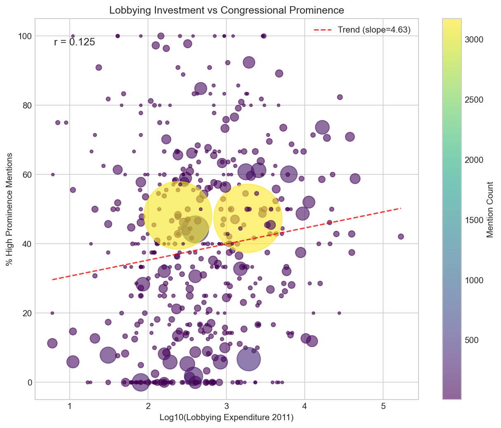
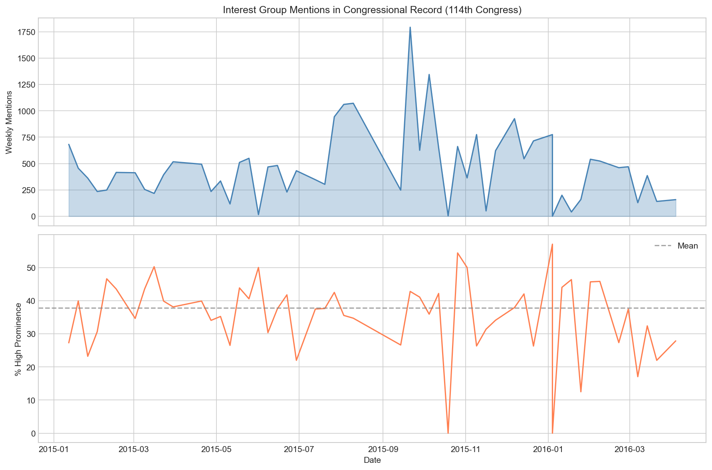
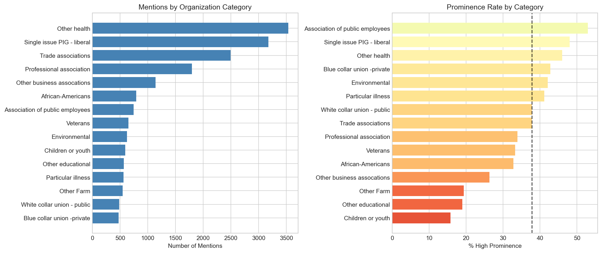
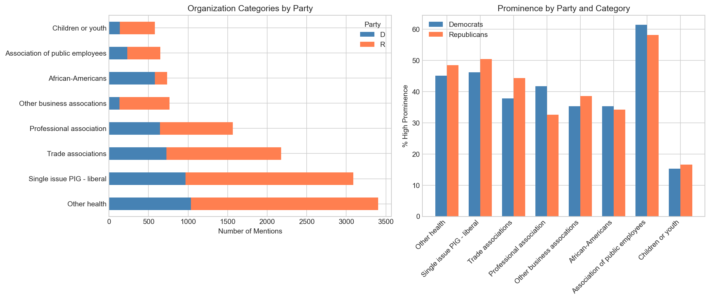
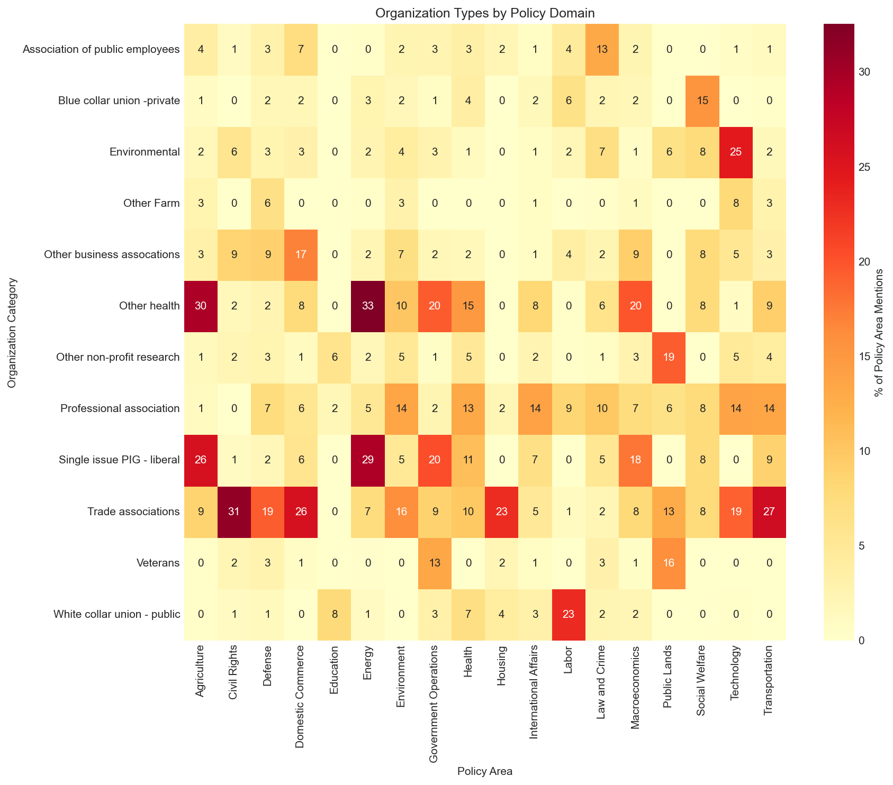

# Interest Group Prominence in Congressional Speech

[](https://www.python.org/downloads/)
[](https://www.r-project.org/)
[](https://opensource.org/licenses/MIT)
[](https://github.com/psf/black)
[](https://streamlit.io/)

> **A complete data science pipeline for analyzing how interest groups are mentioned in U.S. Congressional speech, featuring ML-based prominence classification, multi-level statistical analysis, and reproducible research workflows.**

<p align="center">
  
</p>

---

## Overview

This project analyzes **25,000+ interest group mentions** in the 114th U.S. Congress (2015-2017) to understand:

- **Which organizations** receive prominent vs. passing mentions in floor speeches
- **What predicts prominence**: lobbying expenditure, organization type, speaker characteristics
- **Partisan patterns**: Do Democrats and Republicans mention groups differently?

### Key Findings

| Finding | Evidence |
|---------|----------|
| **Lobbying predicts prominence** | +7.4% higher odds per log unit increase (p < 0.001) |
| **Senators > Representatives** | +45% higher odds of prominent mentions (p < 0.001) |
| **Democrats give fewer prominent mentions** | -23% compared to Republicans (p < 0.001) |
| **Single-issue groups get noticed** | +41% higher prominence rate (p < 0.001) |

---

## Project Context

### Master's Thesis Revamp

This repository is a **complete rewrite** of the data pipeline originally developed for my Master's thesis in Political Science. The original thesis examined how interest groups gain visibility in congressional discourse.

**What's new in this version:**
- Modular, production-ready Python codebase (vs. research scripts)
- Automated ML classification pipeline (F1 = 0.91)
- Multi-level statistical analysis framework
- Congress.gov API integration for bill/member metadata
- Comprehensive data validation and testing
- Professional documentation and reproducibility

**Original thesis repository:** [MastersThesis_InterestGroupAnalysis](https://github.com/kmazurek95/MastersThesis_InterestGroupAnalysis)

---

## Features

### Data Pipeline

```
Raw Data                    Processing                    Analysis
─────────────────────────────────────────────────────────────────────
Congressional Record  ──►  Normalize & Parse     ──►  Level 1: Mentions
(GovInfo API)              Extract Mentions           Level 2: Organizations
                           Attribute Speakers         Level 3: Politicians
Congress.gov APIs     ──►  Classify Prominence        Level 4: Policy Areas
(Bills, Members)           Merge Metadata
                                                       ↓
Interest Group Data   ──►  Match Organizations    ──►  Regression Models
(WRS 2011)                                            Visualizations
```

### Technical Highlights

- **ETL Pipeline**: Modular stages for collection, processing, classification, integration
- **ML Classification**: TF-IDF + Logistic Regression for prominence prediction (91% F1)
- **Multi-level Modeling**: Hierarchical data structure for nested analysis
- **API Integration**: GovInfo, Congress.gov, Google Trends
- **Validation Framework**: Automated data quality checks at each pipeline stage

---

## Quick Start

### Installation

```bash
# Clone the repository
git clone https://github.com/kmazurek95/ThesisPipelineRework.git
cd ThesisPipelineRework

# Create virtual environment
python -m venv .venv
source .venv/bin/activate  # Linux/Mac
# or: .venv\Scripts\activate  # Windows

# Install dependencies
pip install -r requirements.txt
```

### Run the Analysis

```bash
# Validate data integrity
python scripts/validate_data.py

# Build analysis datasets (requires raw data)
python -m interest_group_analysis.4_integration.build_analysis_dataset

# Generate figures and tables
python -m interest_group_analysis.5_analysis.descriptive_analysis
python -m interest_group_analysis.5_analysis.regression_analysis
```

### Interactive Notebook

For an interactive walkthrough with visualizations:

```bash
jupyter notebook notebooks/Analysis_Showcase.ipynb
```

### Interactive Dashboard

Launch the Streamlit dashboard:

```bash
streamlit run dashboard/Home.py
```

### R Multilevel Models

Run the R analysis:

```bash
cd R_analysis
Rscript run_analysis.R
```

---

## Repository Structure

```
ThesisPipelineRework/
├── interest_group_analysis/     # Core Python package
│   ├── 1.data_collection/       # API data collection modules
│   ├── 2.data_processing/       # ETL and normalization
│   ├── 3.classification/        # ML prominence classifier
│   ├── 4_integration/           # Data merging pipeline
│   └── 5_analysis/              # Statistical analysis
│
├── scripts/                     # Standalone utility scripts
│   ├── validate_data.py         # Data quality validation
│   ├── collect_bills.py         # Congress.gov bill fetcher
│   └── collect_members.py       # Member metadata fetcher
│
├── notebooks/                   # Jupyter notebooks
│   ├── Analysis_Showcase.ipynb  # Interactive analysis demo
│   └── Classification_Analysis.ipynb  # ML classifier deep-dive
│
├── R_analysis/                  # R statistical analysis
│   ├── Multilevel_Analysis.Rmd  # lme4 multilevel models
│   ├── run_analysis.R           # Execution script
│   └── requirements-r.txt       # R package dependencies
│
├── dashboard/                   # Streamlit interactive dashboard
│   ├── Home.py                  # Landing page
│   ├── pages/                   # Dashboard pages
│   └── utils/                   # Data loading, visualization helpers
│
├── docs/                        # Documentation
│   ├── METHODOLOGY.md           # Detailed methodology
│   └── REPLICATION.md           # Step-by-step replication guide
│
├── data/                        # Data directory (see data/README.md)
│   ├── reference/               # Static reference files
│   ├── training/                # ML training data
│   ├── raw/                     # Raw API outputs (gitignored)
│   ├── intermediate/            # Processing artifacts (gitignored)
│   └── output/                  # Final analysis datasets
│
├── outputs/                     # Analysis outputs
│   ├── figures/                 # Generated visualizations
│   └── tables/                  # Regression results, summaries
│
├── results_classifier/          # Trained ML model artifacts
│
└── tests/                       # Unit and integration tests
```

---

## Data

### Output Datasets

| File | Level | Rows | Description |
|------|-------|------|-------------|
| `level1.csv` | Mention | 25,106 | Individual mention-level data |
| `level2_org.csv` | Organization | 1,679 | Aggregated by interest group |
| `level3_politician.csv` | Politician | 490 | Aggregated by Congress member |
| `level4_policy.csv` | Policy | 18 | Aggregated by policy area |

### Key Variables

**Outcome:**
- `prominence_prediction`: Binary (0/1) ML-classified prominence

**Organization Characteristics:**
- `LOBBYING11`: Total lobbying expenditure (2011)
- `CATEGORY`: Interest group type (trade, labor, single-issue, etc.)
- `FOUNDED`: Organization founding year

**Speaker Characteristics:**
- `party`: D/R/I
- `chamber`: H (House) / S (Senate)
- `bioGuideId`: Unique Congress member identifier

**Context:**
- `issue_area`: Policy domain (21 CAP categories)
- `salience`: Google Trends-based issue salience

---

## Methodology

### Prominence Classification

Interest group mentions are classified as **high prominence** (substantive discussion) vs. **low prominence** (passing reference) using:

1. **Text Features**: TF-IDF on surrounding paragraph context
2. **Model**: Logistic Regression with L2 regularization
3. **Training**: 907 manually labeled examples
4. **Performance**: 91% F1-score (5-fold cross-validation)

### Statistical Models

**Model 1: Mention-Level (Logistic)**
```
P(High Prominence) ~ log(Lobbying) + Party + Chamber + Org_Type
```

**Model 2: Organization-Level (OLS)**
```
Avg_Prominence ~ log(Lobbying) + log(Mentions) + Org_Type
```

**Model 3: Politician-Level (OLS)**
```
Avg_Prominence ~ Party + Chamber + log(Mentions)
```

---

## Results

### Visualizations

<table>
<tr>
<td><br/><em>Mentions Over Time</em></td>
<td><br/><em>Organization Categories</em></td>
</tr>
<tr>
<td><br/><em>Party Patterns</em></td>
<td><br/><em>Policy Area Heatmap</em></td>
</tr>
</table>

### Regression Summary

| Variable | Model 1 (Logit) | Model 2 (OLS) | Model 3 (OLS) |
|----------|-----------------|---------------|---------------|
| log_lobbying | 0.071*** | 0.013*** | - |
| is_democrat | -0.259*** | - | -0.091*** |
| is_senate | 0.370*** | - | 0.083** |
| is_labor | 0.136** | 0.025 | - |
| is_single_issue | 0.343*** | 0.096* | - |
| **N** | 22,248 | 748 | 390 |

*Significance: \*p<0.05, \*\*p<0.01, \*\*\*p<0.001*

---

## Technologies

- **Languages**: Python 3.10+, R 4.0+
- **Data Processing**: pandas, numpy, tidyverse
- **Machine Learning**: scikit-learn, nltk, SHAP
- **Statistics**: statsmodels, lme4 (R)
- **Visualization**: matplotlib, seaborn, ggplot2, Plotly
- **Dashboard**: Streamlit
- **APIs**: requests, python-dotenv
- **Testing**: pytest

---

## Skills Demonstrated

### Data Science & Machine Learning
- **Text Classification**: TF-IDF + Logistic Regression with 91% F1-score
- **Model Evaluation**: ROC/PR curves, SHAP explanations, error analysis
- **Cross-Validation**: Group-aware K-fold CV to prevent data leakage
- **Feature Engineering**: Text preprocessing, n-gram extraction, metadata integration

### Statistical Modeling
- **Multilevel/Hierarchical Models**: lme4 GLMER with crossed random effects
- **Regression Analysis**: Logistic, OLS, and mixed-effects models
- **Survey Methodology**: Multi-level nested data structures
- **Model Diagnostics**: ICC, AIC/BIC comparison, residual analysis

### Data Engineering
- **ETL Pipelines**: Modular Python pipeline with validation at each stage
- **API Integration**: GovInfo, Congress.gov REST APIs with rate limiting
- **Data Quality**: Automated validation, integrity checks, reproducible workflows
- **Version Control**: Git, GitHub, structured branching

### Visualization & Communication
- **Publication-Quality Figures**: matplotlib, seaborn, ggplot2 (300 DPI)
- **Interactive Dashboards**: Streamlit with caching and dynamic filtering
- **Technical Writing**: R Markdown reports, Jupyter notebooks
- **Data Storytelling**: Clear narratives from complex statistical results

---

## For Recruiters

### PhD Programs (Political Science / Computational Social Science)
This project demonstrates:
- **Original research contribution** to interest group and legislative politics literature
- **Methodological sophistication**: NLP classification, multilevel modeling, causal inference thinking
- **Publication-ready outputs**: Tables, figures, and reports suitable for academic journals
- **Interdisciplinary skills**: Bridging computer science methods with social science questions

### Survey Data Analyst Roles
Relevant experience includes:
- **Complex survey data structures**: Multi-level/hierarchical data (mentions nested in organizations, politicians, policy areas)
- **Statistical modeling**: Logistic regression, mixed-effects models, variance decomposition
- **Data quality assurance**: Validation frameworks, automated integrity checks
- **Reproducible research**: Documented workflows, version control, clear methodology

### Dashboard & Visualization Specialist Roles
This project showcases:
- **Interactive Streamlit dashboard** with filtering, caching, and responsive design
- **Publication-quality static visualizations** using matplotlib, seaborn, and ggplot2
- **Data-driven storytelling**: Translating regression coefficients into actionable insights
- **Full-stack data workflow**: From raw APIs to polished visual outputs

### Data Science / ML Engineer Roles
Technical highlights:
- **End-to-end ML pipeline**: Data collection → preprocessing → training → evaluation → deployment
- **Model interpretability**: SHAP values, feature importance, error analysis
- **Production-ready code**: Modular design, comprehensive testing, documentation
- **API development**: Data collection scripts with error handling and rate limiting

---

## Analysis Notebooks

| Notebook | Description |
|----------|-------------|
| [`Analysis_Showcase.ipynb`](notebooks/Analysis_Showcase.ipynb) | Executive summary with key findings and visualizations |
| [`Classification_Analysis.ipynb`](notebooks/Classification_Analysis.ipynb) | Deep-dive into ML classifier: SHAP, error analysis, model comparison |
| [`R_analysis/Multilevel_Analysis.Rmd`](R_analysis/Multilevel_Analysis.Rmd) | Multilevel models with lme4, coefficient plots, diagnostics |

---

## Contributing

Contributions are welcome! Please see [CONTRIBUTING.md](CONTRIBUTING.md) for guidelines.

1. Fork the repository
2. Create a feature branch (`git checkout -b feature/amazing-feature`)
3. Commit changes (`git commit -m 'Add amazing feature'`)
4. Push to branch (`git push origin feature/amazing-feature`)
5. Open a Pull Request

---

## Citation

If you use this code or data in academic work, please cite:

```bibtex
@software{mazurek2025interest,
  author = {Mazurek, Kaleb},
  title = {Interest Group Prominence in Congressional Speech},
  year = {2025},
  url = {https://github.com/kmazurek95/ThesisPipelineRework}
}
```

---

## License

This project is licensed under the MIT License - see [LICENSE](LICENSE) for details.

---

## Acknowledgments

- **Data Sources**: GovInfo API, Congress.gov API, Washington Representatives Study (2011)
- **Original Research**: Master's thesis in Political Science
- **Tools**: Built with assistance from Claude AI

---

## Contact

**Kaleb Mazurek**
- GitHub: [@kmazurek95](https://github.com/kmazurek95)
- LinkedIn: [Connect](https://linkedin.com/in/kalebmazurek)

---

<p align="center">
  <em>Transforming congressional text into actionable political insights</em>
</p>
